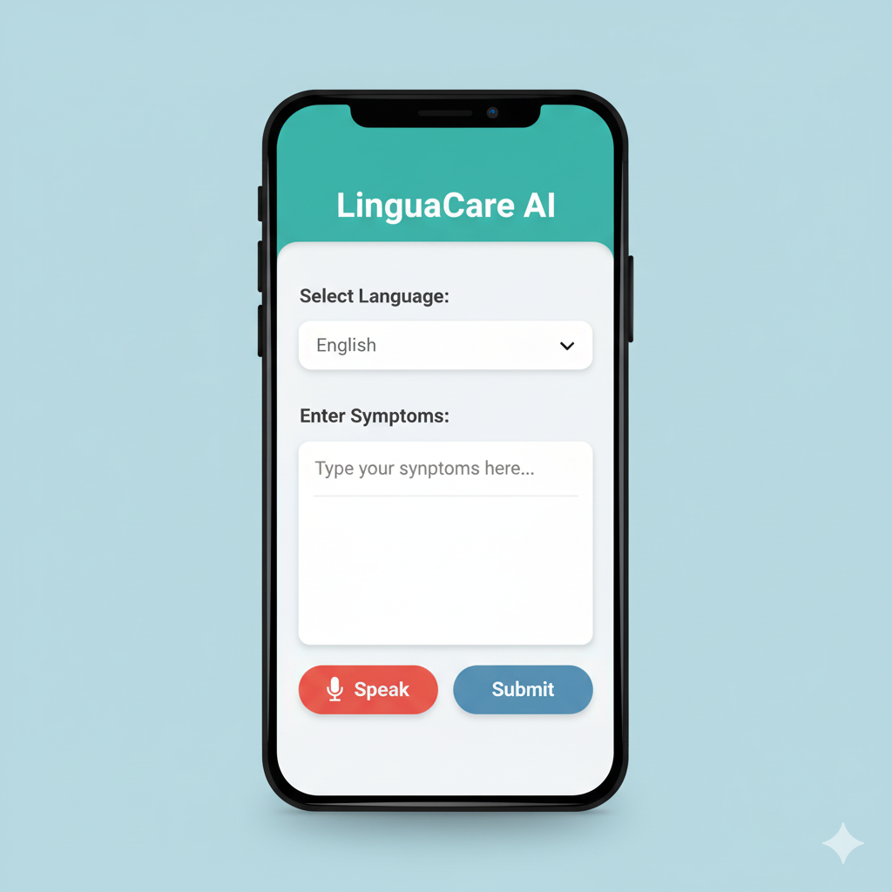

# LinguaCare AI Mobile Application

**Final Year Project (FYP) - Month 1, Week 1 Progress**

---

## 1. Project Overview

The LinguaCare AI Mobile Application is a Final Year Project aimed at providing a user-friendly interface for individuals to input their medical symptoms, primarily through voice and text. This application will serve as an initial step towards a smart healthcare assistant, leveraging Artificial Intelligence (AI) for symptom analysis and preliminary guidance. The core objective is to facilitate easy and accessible symptom reporting, especially for diverse linguistic backgrounds, starting with English, Urdu (اردو), and Pashto (پښتو).

---

## 2. Week 1 Achievements

This week focused on setting up the foundational development environment, initializing the project, implementing the core user interface (UI) components, and establishing robust version control practices with Git and GitHub.

**Key accomplishments include:**

*   **Development Environment Setup:** Successfully installed and configured all necessary tools, including Node.js (with npm), VS Code, the Expo Go mobile app, and Expo CLI.
*   **Project Initialization:** A new React Native project, `LinguaCareMobileApp`, was created using `npx create-expo-app`, establishing the initial project structure.
*   **Core UI Scaffolding:** Designed and implemented the basic user interface for the symptom input screen, comprising:
    *   A visually distinct application header displaying "LinguaCare AI".
    *   A functional language selection dropdown (`Picker`) supporting English, Urdu (اردو), and Pashto (پښتو).
    *   A multi-line text input field (`TextInput`) for users to enter detailed symptom descriptions.
    *   Two aesthetically designed placeholder buttons: "🎙️ Speak" for future voice input, and "Submit" for data submission.
    *   Basic event handlers (`handleMicPress`, `handleSubmit`) providing console logs and alerts for immediate user feedback.
*   **State Management:** Implemented React's `useState` hook to manage the application's dynamic data, specifically the `selectedLanguage` and `symptomText`.
*   **Styling & Layout:** Applied comprehensive styling using `StyleSheet` and Flexbox principles to ensure a clean, responsive, and intuitive user experience across different devices. This included defining custom color palettes and shadow effects.
*   **Version Control Integration (Git & GitHub):**
    *   Initialized a local Git repository automatically with project creation.
    *   Manually created a corresponding empty remote repository on GitHub (`LinguaCareMobileApp`).
    *   Successfully linked the local repository to the GitHub remote (`git remote add origin ...`).
    *   Staged and committed all Week 1 code changes with a descriptive commit message.
    *   Successfully pushed the local `master` branch to the `origin` (GitHub) repository (`git push -u origin master`), establishing a complete version-controlled workflow and ensuring code backup.
*   **Documentation:** Created and updated a comprehensive `README.md` file, providing a clear project overview, detailed achievements, run instructions, and visual representations.

---

## 3. Screenshots (Week 1 UI)

Here's a visual representation of the LinguaCare AI app's user interface after the completion of Week 1:



---

## 4. How to Run the Project Locally

To set up and run the LinguaCare AI mobile application on your local development environment and mobile device:

**Prerequisites:**
*   **Node.js (LTS version) & npm:** Download and install from [nodejs.org](https://nodejs.org).
*   **VS Code:** Download and install from [code.visualstudio.com](https://code.visualstudio.com).
*   **Expo Go App:** Install on your Android (Google Play Store) or iOS (Apple App Store) device.
*   **Expo CLI:** Install globally via terminal: `npm install -g expo-cli`.

**Steps:**

1.  **Clone the repository:** Open your terminal or command prompt and execute:
    ```bash
    git clone https://github.com/NasiraRiaz/LinguaCareMobileApp.git
    ```

2.  **Navigate into the project directory:**
    ```bash
    cd LinguaCareMobileApp
    ```

3.  **Install project dependencies:**
    ```bash
    npm install
    ```

4.  **Start the Expo development server:**
    ```bash
    npm start
    # or alternatively
    # npx expo start
    ```
    This will open the Expo Dev Tools in your browser and display a QR code in the terminal.

5.  **View on your mobile device:**
    *   Open the **Expo Go app** on your physical phone.
    *   **Scan the QR code** displayed in your terminal or the Expo Dev Tools browser page using the Expo Go app (Android) or your phone's default camera (iOS).
    *   The app bundle will download, and the LinguaCare AI application will launch on your device.

---

## 5. Project Structure (Relevant for Week 1)
LinguaCareMobileApp/
├── app/
│   └── index.tsx # Main application UI and logic for symptom input screen.
├── node_modules/ # Installed JavaScript packages.
├── screenshots/ # Directory for project screenshots and visual assets.
│   └── week1_ui.png # Screenshot of the Week 1 UI.
├── .gitignore # Specifies intentionally untracked files to ignore by Git.
├── app.json # Expo configuration file for the app.
├── babel.config.js # Babel configuration for JavaScript transpilation.
├── package.json # Lists project dependencies and scripts.
├── README.md # This file, providing project overview and instructions.
└── ... (other Expo-generated files)
---

## 6. Future Work (Week 2 Onwards)

The following areas are planned for development in subsequent weeks:

*   Implementation of actual voice input and speech-to-text functionality using the microphone.
*   Integration with a backend API for processing and storing symptom data.
*   Development or integration of Artificial Intelligence (AI) models for symptom analysis and preliminary diagnostic suggestions.
*   Enhancement of the user interface and user experience (UI/UX) based on testing and feedback.
*   Authentication and user profile management.

---

## 7. Contact / Authors

*   **Name:** NASIRA RIAZ
*   **Email:** nasirariaz612@gmail.com
*   **GitHub Profile:** https://github.com/NasiraRiaz/